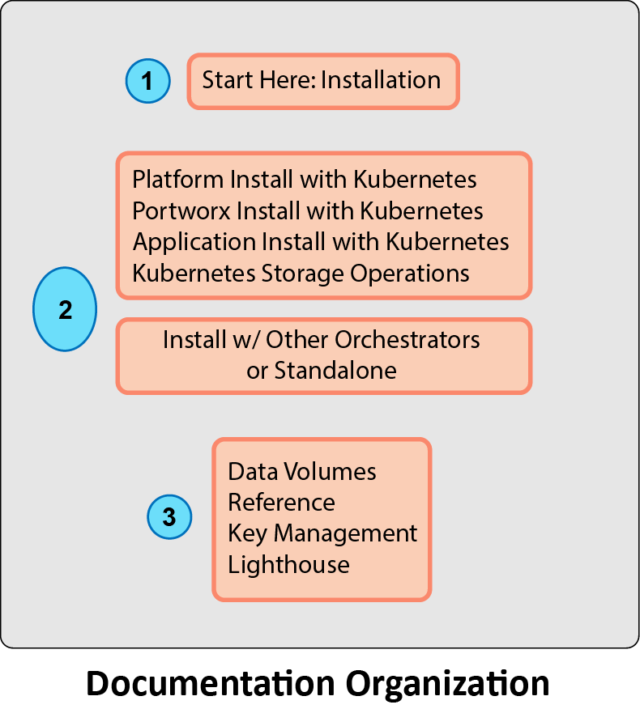

# Portworx Documentation

This guide teaches you how to install and maintain Portworx. The guide is divided into three parts, as illustrated below.

Begin by reading the section _Start Here: Installation_ in Part 1. 

Following that, proceed to Part 2. Follow one of the two paths shown in the orange circular rectangles. The path you take depends on the container orchestrator you are using during your install.

After finishing Part 2, your Portworx installation is complete. You should read Part 3 for information on maintaining Portworx.

As you work through the install in Parts 1 and 2, you do not need to refer back to this page to see what to do next. The instructions will guide you along the right path.

### Release Notes



